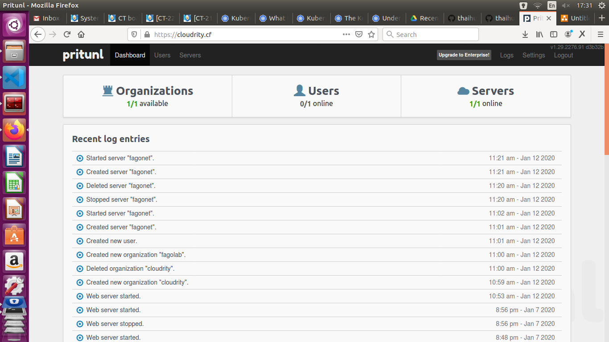

# Install Pritunl VPN Server

### 1. Deployment Model


### 2. Environment
- Ubuntu 18.04 LTS

### 3. Install MongoDB


```sh
export MONGO_IP=192.168.122.100

sudo tee /etc/apt/sources.list.d/mongodb-org-4.0.list << EOF
deb https://repo.mongodb.org/apt/ubuntu bionic/mongodb-org/4.0 multiverse
EOF

sudo apt-key adv --keyserver hkp://keyserver.ubuntu.com --recv 9DA31620334BD75D9DCB49F368818C72E52529D4

sudo apt-get update
sudo apt-get --assume-yes install mongodb-server

sed -i "s|bind_ip = 127.0.0.1|bind_ip = ${MONGO_IP}|g" /etc/mongodb.conf
systemctl restart mongodb
systemctl enable mongodb
```

### 4. Install Pritunl


```sh
export VERSION=1.29.2276.91

mkdir -p /usr/src/pritunl-dev
cd /usr/src/pritunl-dev
apt-get update
apt-get -y install git bzr python python-dev python-pip net-tools openvpn bridge-utils psmisc build-essential

wget https://dl.google.com/go/go1.12.1.linux-amd64.tar.gz
sudo tar -C /usr/local -xf go1.12.1.linux-amd64.tar.gz
rm -f go1.12.1.linux-amd64.tar.gz
tee -a ~/.bashrc << EOF
export GOPATH=\$HOME/go
export PATH=/usr/local/go/bin:\$PATH
EOF
source ~/.bashrc

go get -u github.com/pritunl/pritunl-dns
go get -u github.com/pritunl/pritunl-web
sudo ln -s ~/go/bin/pritunl-dns /usr/bin/pritunl-dns
sudo ln -s ~/go/bin/pritunl-web /usr/bin/pritunl-web

wget https://github.com/pritunl/pritunl/archive/$VERSION.tar.gz
tar xf $VERSION.tar.gz
cd pritunl-$VERSION
python2 setup.py build
pip install -r requirements.txt
sudo python2 setup.py install
ln -s /usr/local/bin/pritunl /usr/bin/pritunl

sudo systemctl daemon-reload
sudo systemctl start pritunl
sudo systemctl enable pritunl
```

### 5. Post installation

- Get pritunl setup key:

```sh
pritunl setup-key
```
Sample output: `98995a14729543ea98606b4503031e9c`


- Access pritunl on web browser: https://\<pritunl ip>

Paste pritunl setup-key got above & change mongoDB IP (default: 127.0.0.1)

- Wait till pritunl setup process to be successful.

- Generate pritunl default password:

```sh
pritunl default-password
```

Sample output:

```sh

[undefined][2019-12-29 10:43:47,608][INFO] Getting default administrator password
Administrator default password:
  username: "pritunl"
  password: "tjo1xJswVLM0"

openvpn --config vpn-fagolabs-test_cloud_vpn-demo-inst.ovpn
```

Paste username and password to browser and getting started with pritunl.

### 6. Setup Let's Encrypt

- Login pritunl server: https://cloudrity.cf. Click "Settings":





- On the ```Settings``` popup, type: ```cloudrity.cf``` under "Lets Encrypt", then click "Save":


