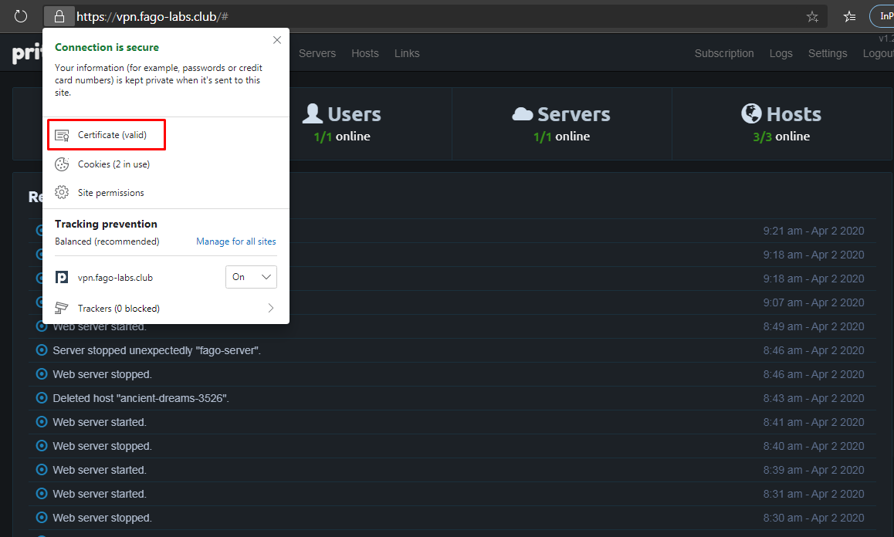

Hacked version Pritunl
# 1. Requirements 
 * Requirement: 3 Servers
    - Ubuntu 16.04 LTS xenial
    - Firewall enabled
    - Network Interfaces: 2 NICs/server
    
| Node | Public IP | Management IP (for MongoDB  Replicaset) |
| --- | --- | --- |
| Node01 | Public IP 1 | MGMT IP 1 |
| Node02 | Public IP 2 | MGMT IP 2 |
| Node03 | Public IP 3 | MGMT IP 3 |

 * Make sure your system is fully updated: 
```
sudo -i
apt-get update
apt-get dist-upgrade -y
```

 * If you are using iptables or ufw firewall, use the following commands to open some port so that Pritunl works properly :

| Direction | Source | Destination | Port/Port Range |
| --- | --- | --- | --- |
| Ingress | 0.0.0.0/0 | - | 80 |
| Ingress | 0.0.0.0/0 | - | 443 |
| Ingress | MGMT Subnet (e.g: 10.60.1.0/24) | - | 27017 |
| Ingress | 0.0.0.0/0 | - | 10000-20000 |
| Egress | - | 0.0.0.0/0 | 80 |
| Egress | - | 0.0.0.0/0 | 443 |
| Egress | - | MGMT Subnet (e.g: 10.60.1.0/24) | 27017 |
| Egress | - | 0.0.0.0/0 | 10000-20000 |

* Register a domain and add 3 A-Records, pointing domain to 3 public IPs belong to Pritunl Servers. E.g:

| Record Type | Name | Value |
| --- | --- | --- |
| A | vpn.fago-labs.club | Public IP 1 |
| A | vpn.fago-labs.club | Public IP 2 |
| A | vpn.fago-labs.club | Public IP 3 |

Or

| Record Type | Name | Value |
| --- | --- | --- |
| A | fago-labs.club | Public IP 1 |
| A | fago-labs.club | Public IP 2 |
| A | fago-labs.club | Public IP 3 |
| CNAME | vpn.fago-labs.club | fago-labs.club |


# 2. Installation

 * Clone source code from repository: 
```
sudo su
cd /usr/src
git clone https://github.com/fagolabs/fVPN
```
 * Go to the folder cloned: 
```
cd /usr/src/fVPN/vpn-portal/pritunl
```
 * Run file install.sh: 
```
sudo su
chmod +x install.sh && bash install.sh
```

# 3. Setup MongoDB Replica Set

# 4. Post installation

## 4.1 Setup the 1st server

- SSH to the 1st Pritunl server and go to setup folder:

```
cd /usr/src/fVPN/vpn-portal/pritunl
```

- Get pritunl setup key:
```
python server.py setup-key
```
Sample output: `4e500b26f1df408fabc19c105544c501`

- Access pritunl on web browser: https://\<Public IP of the 1st pritunl server>

Paste pritunl setup-key got above & change mongoDB IP (default: 127.0.0.1)

- Wait till pritunl setup process to be successful.

- Reset pritunl password:
```
python server.py reset-password
```

Sample output:
```
 Getting default administrator password
Administrator default password:
  username: "pritunl"
  password: "aFrSG0AwZoLr"
```

Paste username and password to browser and getting started with pritunl.

## 4.2 Setup the 2 remaining servers

Repeat the following steps for each of remaining servers:

- SSH to pritunl server and go to setup folder:

```
cd /usr/src/fVPN/vpn-portal/pritunl
```

- Get pritunl setup key:
```
python server.py setup-key
```
Sample output: `4e500b26f1df408fabc19c105544c501`

- Access pritunl on web browser: https://\<Public IP of the 1st pritunl server>

Paste pritunl setup-key got above & change mongoDB IP (default: 127.0.0.1)

- Wait till pritunl setup process to be successful.

# 5. Setup Let's Encrypt

- Login pritunl server: https://vpn.fago-labs.club. Click "Settings". On the popup, type: ```vpn.fago-labs.club``` under "Lets Encrypt Domain", then click "Save":


- Wait till pritunl setup Let's Encrypt certificates successfully. Result should be like below:




# Features

1. full enterprise's features without remote subscription checking
2. dark mode/ light mode available
3. removed subscription status button
4. create new administrator account with enterprise subscription
5. ready with 2 accounts: pritunl and dev
