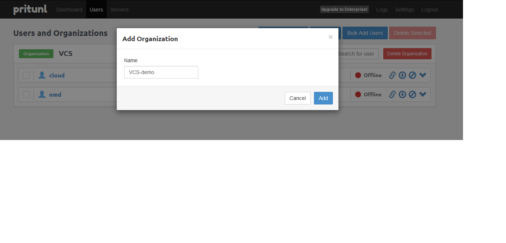
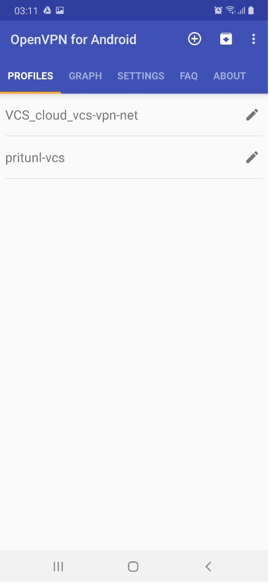

# Pritunl user guide

---

1. Cấu hình tạo user quản trị portal
Tham khảo trong guide ```INSTALL.md```, mục 
 ```5. Post installation```. Sau khi deploy xong sẽ phải cấu hình mặc định một user quản trị portal.

2. Quản lý organization & users

2.1. Quản lý organization

a) Tạo một organization
Bước 1: Đăng nhập portal quản trị: https://<pritunl server ip>. Sử dụng account quản trị mặc định (Tham khảo mục 2.1). Trong lần đầu đăng nhập, cửa sổ setup cơ bản hiện ra như sau:


Giữ các thiết lập mặc định. Việc cấu hình nâng cao sẽ chỉnh sửa sau.

Bước 2: Vào tab Users  click Add Organization


Nhập tên Organization, sau đó click Add


Kết quả tạo Organization thành công như sau


b) Xóa một organization

2.2. Quản lý VPN client user

a) Tạo user

Bước 1: Trên portal, click tab Users  click Add User


Bước 2: Cấu hình các thông tin cho user mới, bao gồm:
Name: đặt tùy ý
Select an organization, chọn một trong các organization đã tạo
Email: user mail (có thể bỏ qua)
Pin: password của user, cần phải lưu lại giá trị pin này để sử dụng cho thao tác import profile từ VPN client (sẽ trình bày ở bên dưới)


Kết quả thành công tương tự như sau:


b) Chỉnh sửa/xóa user

3. Quản lý VPN instance

3.1. Tạo VPN instance & attach organization

**Mục đích**: Tạo một VPN instance bản chất là tạo một routed private network trên VPN server (trong mô hình Single Deployment), mạng này sẽ là mạng nội bộ cho các VPN client kết nối vào và được cấu hình routing ra ngoài internet qua card mạng public cấu hình trên VPN server.
Có thể tạo nhiều VPN instance khác nhau tương ứng nhiều private network khác nhau trên cùng 1 VPN server.

**Thực hiện:**

Bước 1: Trên portal, truy cập tab Servers, sau đó click Add Server


Trên giao diện mới, cấu hình cho VPN instance (khái niệm của pritunl là Server), chỉ cần cấu hình cơ bản gồm các thông tin sau:

- **Name**: VPN instance name

- **DNS Server**: sử dụng DNS của google (8.8.8.8)

- **Port**: port để VPN client kết nối tới

- **Protocol**: chọn mặc định là udp

- **Virtual network**: private network address cấu hình cho VPN instance trên VPN server, có thể giữ mặc định hoặc sửa lại theo ý muốn
Enable Ipv6 & Enable Google Authenticator: giữ thiết lập mặc định (không tích chọn hai tùy chọn này)


Click Add để tạo VPN instance. Sau khi tạo xong VPN instance, thông tin VPN instance mới xuất hiện sẽ tương tự như sau:


Bước 2: Attach Organization với VPN instance: 
Vẫn trên tab Servers, click Attach Organization


Trên giao diện mới, Click lựa chọn cặp Organization và VPN instance muốn attach


Kết quả thành công như sau:


Ví dụ ở đây attach Organization là VCS-demo và VPN instance là vpn-demo-net

Bước 3: Start VPN Instance: 
Trên giao diện Server, chọn lấy 1 VPN instance đã tạo, click Start Server


**Chú ý**: Để start được server, Organization cần có ít nhất 1 User, nếu không tùy chọn Start Server sẽ bị disable (bị làm mờ trên giao diện và không tương tác được)

Kết quả start server thành công sẽ có log tương tự như sau:


3.2. Detach organization

3.3. Xóa VPN instance

4. Kết nối VPN client và VPN server

4.1. Kết nối từ thiết bị di động (smarphone, tablet)

4.1.1 OpenVPN client

Bước 1: Tải OpenVPN client, ví dụ với hệ điều hành Android, cài đặt OpenVPN for Android:


Bước 2: Mở ứng dụng, click biểu tượng dấu cộng trên giao diện để import user profile (*.ovpn):



Chọn Import để tìm user profile lưu trong máy


Chọn profile và open 


Click biểu tượng dấu tích chọn để lưu lại profile trên ứng dụng


Trên giao diện chính, click biểu tượng chỉnh sửa để thay đổi thiết lập của VPN client:


Trên giao diện mới, nhập hai thông tin xác thực của user ở tab Basic:

Username: cloud-demo
Password: chính là giá trị PIN khi thiết lập tạo user


Quay trở lại màn hình chính, click vào tên của client vừa mới chỉnh sửa, sau đó quá trình kết nối từ client tới VPN server sẽ được thực hiện


4.2. Kết nối từ PC

4.2.1 GUI

Bước 1: Tải và cài đặt OpenVPN client (hướng dẫn sau thực hiện trên Windows):
Windows: https://openvpn.net/downloads/openvpn-connect-v2-windows.msi

Bước 2: Get user profile trên portal:
Trên portal, truy cập tab Users, click tải user profile như sau:


Sau khi tải profile về, giải nén để lấy profile định dạng: *.ovpn


Bước 3: Import profile vào VPN client, thực hiện như sau:


Ở bước này, nhập user name match chính xác với user name trên portal, còn password chính là giá trị PIN thiết lập ở thao tác tạo User, hướng dẫn ở mục 2.2 – a). Sau đó click Connect


Trên giao diện này, nhập lại giá trị PIN một lần nữa và click Continue. Kết quả kết nối thành công tương tự như sau:


Kiểm tra trên portal thấy user đang online, chứng tỏ đã kết nối thành công:


4.2.2 Command line
